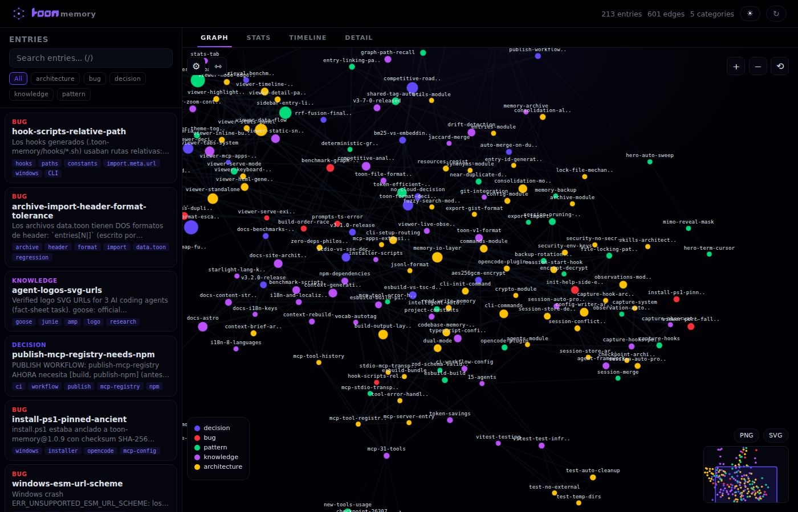
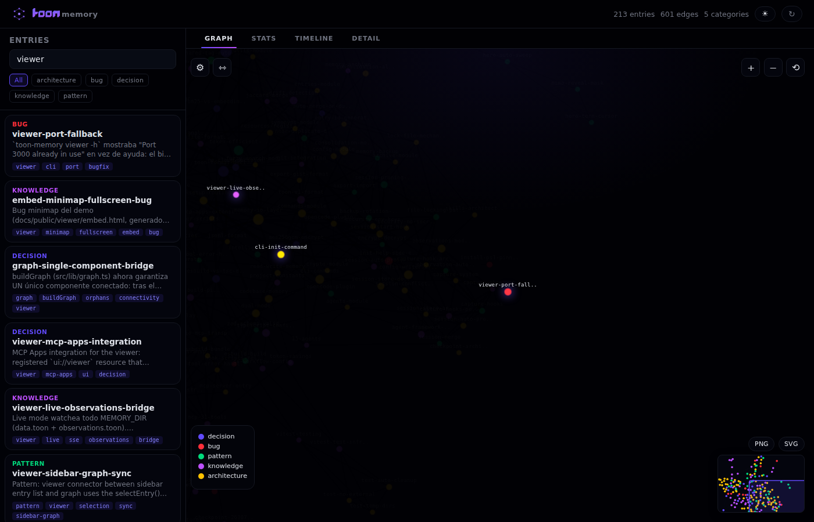
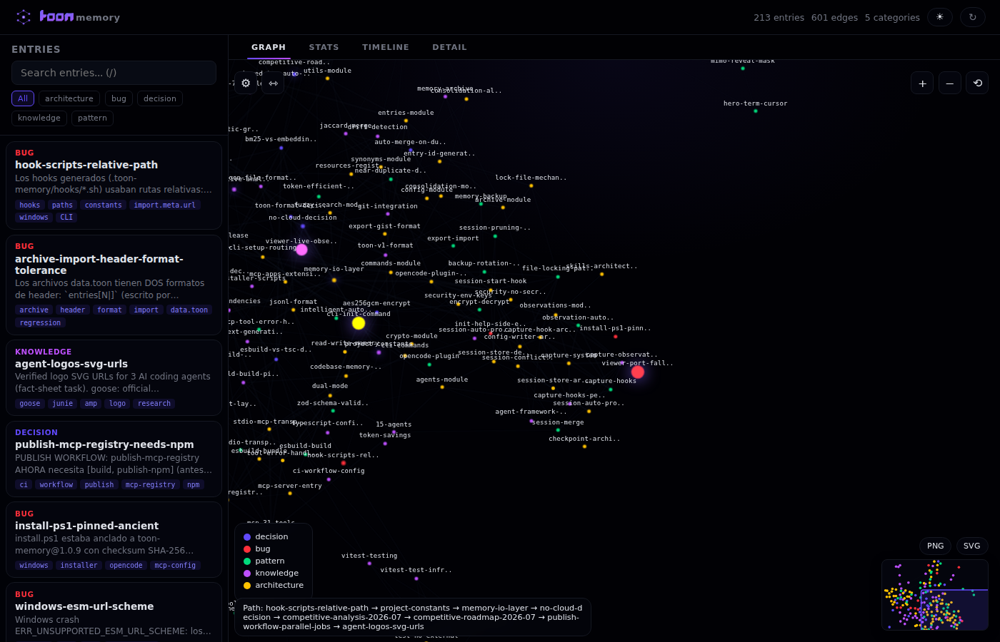
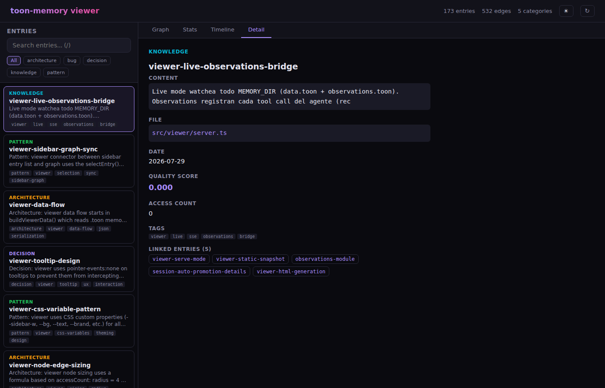
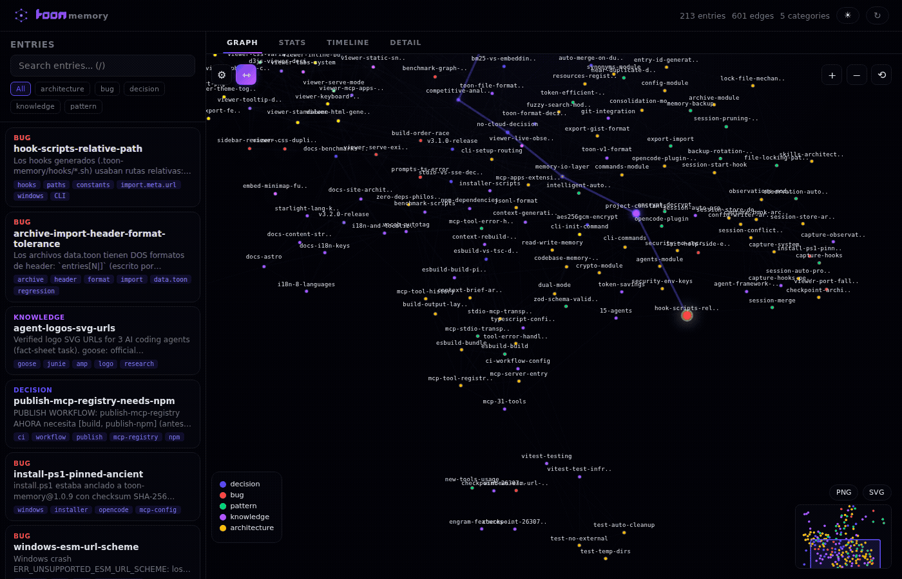

[English](README.md) | [Español](README.es.md) | [中文](README.zh.md) | [日本語](README.ja.md) | [한국어](README.ko.md) | [Português (BR)](README.pt-br.md) | [Deutsch](README.de.md) | [Français](README.fr.md)

# toon-memory

> Servidor MCP de memoria para agentes de IA — recuerda decisiones, patrones y bugs entre sesiones.

[](https://www.npmjs.com/package/toon-memory)
[](https://opensource.org/licenses/MIT)
[](https://github.com/LuiggiVal08/toon-memory/actions/workflows/ci.yml)
[](https://luiggival08.github.io/toon-memory/)
[](https://lobehub.com/mcp/luiggival08-toon-memory)

---

## Tabla de Contenidos

- [¿Qué es toon-memory?](#qué-es-toon-memory)
- [Artículo del Blog](#artículo-del-blog)
- [Características](#características)
- [Inicio Rápido](#inicio-rápido)
- [Agentes Soportados](#agentes-soportados)
- [Herramientas MCP](#herramientas-mcp)
- [Coordinación multi-sesión](#coordinación-multi-sesión)
- [Grafo de Memoria (recall basado en grafo)](#grafo-de-memoria-recall-basado-en-grafo)
- [Visualizador del Grafo de Memoria](#visualizador-del-grafo-de-memoria)
- [Consejos y Mejores Prácticas](#consejos-y-mejores-prácticas)
- [Comandos CLI](#comandos-cli)
- [Configuración](#configuración)
- [Cómo Funciona](#cómo-funciona)
- [¿Por qué TOON?](#por-qué-toon)
- [Solución de Problemas](#solución-de-problemas)
- [Preguntas Frecuentes](#preguntas-frecuentes)
- [Desarrollo](#desarrollo)
- [Contribuir](#contribuir)
- [Seguridad y Privacidad](#seguridad-y-privacidad)
- [Licencia](#licencia)

---

## ¿Qué es toon-memory?

¿Alguna vez has tenido esa sensación donde tu agente de IA olvida todo de la sesión de ayer? Explicas la misma decisión de arquitectura por tercera vez, y aún así sugiere el enfoque que ya rechazaste?

**toon-memory soluciona esto.** Le da a tu agente de IA una memoria persistente que sobrevive a reinicios, para que realmente aprenda de tu proyecto con el tiempo.

📖 **[Lee la documentación](https://luiggival08.github.io/toon-memory/)**

### Casos de uso reales

| Escenario | Qué hace toon-memory |
|----------|----------------------|
| Debates de diseño | "Elegimos Redis sobre Memcached por soporte de pub/sub" |
| Elección de framework | "Este proyecto usa Zod para validación, no Joi" |
| Corrección de bugs | "Agotamiento de pool de Redis — la solución fue max_connections=20" |
| Notas de arquitectura | "El servicio broker usa protocolo RESP, no HTTP" |
| Incorporación | "El script de deploy está en scripts/deploy.sh" |
| Contexto del equipo | "PR #142 revirtió el cambio de caché — no volver a agregarlo" |

---

## Artículo del Blog

Lee [Cómo toon-memory Hace tu Agente de IA más Inteligente](https://luiggival08.github.io/toon-memory/blog) para ver una demostración real de memoria persistente en acción.

---

## Características

- **35 herramientas MCP** — Gestión completa de memoria vía Model Context Protocol, incluyendo `memory_smart_recall` (recall unificado), `memory_sessions` para coordinación multi-sesión, herramientas `context_*` para generación de contexto en una sola llamada, `memory_compress` (compresión con LLM), `memory_consolidate` (deduplicación y limpieza deterministas), `memory_primer` (contexto auto-inyectado), `memory_merge_sessions` (fusión multi-sesión), y `memory_export_gist`/`memory_import_gist` (sincronización con GitHub Gist)
- **Recursos MCP** — Lee memoria como contexto sin invocaciones de herramientas, incluyendo un System Primer (mapa de conocimiento auto-generado)
- **15 agentes soportados** — OpenCode, VS Code, Claude Code, Cursor, Windsurf, Cline, Continue, Codex CLI, Gemini CLI, Zed, Antigravity, Aider, KiloCode, OpenClaw, Kiro
- **Instalador interactivo** — Selecciona qué agentes configurar desde un menú
- **Hooks SessionStart** — Recordatorios automáticos para Claude Code, Codex CLI, Gemini CLI, Antigravity
- **Formato TOON** — 22% menos tokens que JSON (medido), mejor comprensión para LLMs
- **Memoria por proyecto** — Cada proyecto tiene su propio archivo de memoria
- **Cero configuración** — Solo instalar y usar
- **Auto gitignore** — Agrega automáticamente `.toon-memory/memory/` a `.gitignore`
- **Filtrado por fecha** — Busca memoria por rango de fechas
- **Auto-archivo** — Entradas antiguas (>30 días), entradas con TTL expirado, o 100+ entradas se mueven al archivo automáticamente
- **Encriptación** — Encriptación AES-256-GCM para datos sensibles
- **Modo watch** — Backup automático cada N minutos
- **TTL de memoria** — Expiración configurable por entrada (7d, 30d, o fechas exactas)
- **Inferencia de tags** — Detecta automáticamente tags del contenido cuando están vacíos (vocabulario integrado + dependencias del proyecto)
- **Diff de memoria** — Ve qué cambió desde tu última sesión
- **Entradas relacionadas** — Sugiere automáticamente memorias relacionadas al guardar
- **Grafo de memoria** — Conecta entradas con referencias `links`/`[[key]]`; `memory_recall` puede expandir un subgrafo consciente de relaciones para un recall más preciso y con menos tokens (sin embeddings, sin LLM)
- **Recall eficiente en tokens** — `memory_recall({ compact: true })` devuelve entradas indexadas numéricamente, omite `id`/`date`/`file`, renderiza aristas del grafo como `->2`, y trunca vecinos del grafo a fragmentos
- **Ranking BM25 + centralidad** — Re-ranking por relevancia BM25 y centralidad de grafo (los hubs aparecen incluso sin la palabra de búsqueda); decaimiento por mantiene nodos distantes bajos
- **Auto-tag desde dependencias** — `toon-memory init` escanea `package.json`/`Cargo.toml`/`requirements.txt`/`go.mod` y escribe un vocabulario del proyecto para que entradas que mencionan una dependencia se auto-tagguen con ella
- **Smart Recall** — `memory_smart_recall` combina BM25 + grafo + decaimiento + calidad en una sola llamada. El LLM usa esto al inicio de cada tarea
- **Scoring de calidad v2** — Cada entrada obtiene un puntaje de calidad 0–1 basado en estructura (tags, links, especificidad del contenido, recencia, cantidad de accesos); las entradas de alta calidad aparecen primero
- **Near-duplicate detection** — La consolidación detecta entradas casi-duplicadas vía similitud Jaccard (umbral 0.7) y las fusiona
- **Merge-dedup** — Guardar con la misma `key` fusiona atributos (unión de tags, máxima confianza, fecha más reciente, links combinados) en lugar de sobrescribir
- **Puntaje de confianza** — Cada entrada rastrea confiabilidad: declarada por usuario = 1.0, inferida = 0.65–0.75
- **Compresión con LLM** — `memory_compress` usa IA para resumir entradas largas; `memory_consolidate(mode: "low-quality")` hace limpieza por lotes de forma determinista
- **Fusión multi-sesión** — `memory_merge_sessions` fusiona observaciones entre sesiones paralelas para un archivo
- **Sincronización con GitHub Gist** — `memory_export_gist` y `memory_import_gist` sincronizan entradas de memoria vía GitHub Gist (sin dependencias externas)
- **Modo verbatim** — `config.verbatim` preserva las entradas originales en lugar de sobrescribir al guardar
- **Herramientas de generación de contexto** — `context_generate` (briefing completo), `context_diff` (incremental), `context_focus` (enfocado), `context_health` (auditoría), `context_export` (markdown) — cada una reemplaza 5-6 llamadas manuales de herramientas. Cero LLM, agregación puramente determinística
- **System Primer** — Auto-inyectado al inicio de sesión vía `systemPrimer()`, mostrando las 5 memorias principales para contexto instantáneo
- **Path Scoping** — Las entradas pueden limitarse a rutas de archivo mediante patrones glob (`path_scope`); el recall filtra por alcance automáticamente
- **Budget Control** — Tres niveles de salida: `budget: "tiny"` (key + 1 línea, ~50 tokens), `"normal"` (compacto con tags/aristas), `"deep"` (todos los campos con origen/alcance/estado). Retrocompatible con `compact: true`
- **Origin Tracking** — Cada entrada rastrea su origen (`human`, `agent`, `inferred`); las afirmaciones humanas obtienen un boost de calidad
- **Soft Delete** — `memory_forget` elimina en modo blando por defecto (establece `status=obsolete`). Restaura con `memory_forget(key, action: "restore")`, oculta con `action: "soft"`, eliminación permanente vía `action: "hard"`
- **Auditoría de salud mejorada** — `context_health` ahora detecta evidencia faltante (path_scope sin archivo) y afirmaciones obsoletas (contenido superpuesto en la misma categoría)
- **Aristas tipadas del grafo** — Las aristas llevan tipos (`superseded_by`, `supersedes`, `relates`), escritas como `type:key` en el grafo. Los `links` explícitos se convierten en `relates:key`, así puedes saber *cómo* se relacionan las entradas, no solo que se relacionan
- **Ranking RRF** — El recall fusiona BM25 (×3) y rangos de centralidad de grafo con Reciprocal Rank Fusion y un `k` adaptativo `clamp(3..60, round(sqrt(n)))`. Benchmark (8 consultas gold): nDCG 0.776, MRR 0.917 — paridad exacta con el scoring lineal previo. Pasa `rrf: false` para volver atrás
- **Memory reflect** — `memory_reflect` ordena las entradas por obsolescencia, calidad y sobre-conexión para destacar lo que necesita atención o limpieza. Determinístico, cero LLM
- **Memory supersede** — `memory_forget(key, action: "supersede", new_key)` marca una entrada como reemplazada por una más nueva (enlace `superseded_by` + fecha `supersededOn`). `memory_recall({ as_of })` re-incluye entradas antiguas para consultas en punto en el tiempo anteriores a su supersession
- **Auto-promote** — `memory_promote` promueve borradores de baja confianza a entradas activas de forma determinista (umbral 0.65, dedup Jaccard), con `dryRun` por defecto
- **Explain WHY** — `memory_recall`/`memory_smart_recall` aceptan `explain: true` y agregan una línea de razón determinística a cada entrada devuelta (`↳ 100% relevance · used 14× · used today · importance HIGH`) — *por qué* se recuperó, sin LLM
- **Presupuesto de tokens** — `budget_tokens` limita la salida del recall por recuento estimado de tokens; las entradas se acumulan greedy y se descarta la cola que excedería el presupuesto (`0` = sin límite)
- **Supersession por versión** — `memory_consolidate(mode: "versions")` detecta entradas que describen el mismo tema en diferentes versiones de librería (p. ej. "Usar React 18" vs "Usar React 19") y retira las antiguas en favor de la más nueva
- **Memorias negativas** — una categoría `warning` para hechos de "NO hagas esto"; las entradas `warning` reciben un boost en recall para que el agente vea las minas antes de repetirlas
- **Ranking por idioma + carpeta** — el recall potencia entradas escritas en la misma familia de escritura (latin/CJK/cyrillic/…) y entradas cuyo `path_scope` coincide con el archivo actual

---

## Inicio Rápido

### 1. Instalar

```bash
# macOS / Linux
curl -fsSL https://raw.githubusercontent.com/LuiggiVal08/toon-memory/main/install.sh | sh

# Windows (PowerShell)
irm https://raw.githubusercontent.com/LuiggiVal08/toon-memory/main/install.ps1 | iex

# O con npm (cualquier plataforma)
npm i -g toon-memory
```

> **Consejo:** La instalación con npm es el método más confiable. Los scripts curl/irm son wrappers de conveniencia.

### 2. Configurar tus agentes

```bash
# Instalador interactivo — detecta agentes y configura MCP
npx toon-memory
```

El instalador:
1. Detectará qué agentes de IA tienes instalados
2. Te preguntará cuáles configurar
3. Agregará la configuración del servidor MCP automáticamente

### 3. ¡Úsalo!

¡Eso es todo! En tu próxima sesión de agente, prueba:

```bash
memory_stats      # Ve qué hay en memoria
memory_recall     # Busca memoria antes de leer archivos
memory_remember   # Guarda decisiones importantes
```

> **Consejo:** Siempre ejecuta `memory_recall` al inicio de una sesión. Tu agente tendrá contexto de sesiones anteriores instantáneamente.

---

## Agentes Soportados

| Agente | Ubicación de Config | Formato | Hooks | Auto-Setup |
|--------|---------------------|---------|-------|------------|
| **OpenCode** | `.opencode/opencode.json` + `.opencode/plugins/toon-memory.ts` | Plugin | SessionStart (plugin, sin `hooks` de nivel superior) | ✅ |
| **VS Code / Copilot** | `.vscode/mcp.json` | JSON | — | ✅ |
| **Claude Code** | `.mcp.json` (MCP) + `.claude/settings.json` (hooks) | JSON | SessionStart + PostToolUse + Stop | ✅ |
| **Cursor** | `.cursor/mcp.json` | JSON | — | ✅ |
| **Windsurf** | `~/.codeium/windsurf/mcp_config.json` | JSON | — | ✅ |
| **Cline** | `.cline/mcp.json` | JSON | — | ✅ |
| **Continue** | `.continue/config.json` | JSON | — | ✅ |
| **Codex CLI** | `.codex/config.toml` | TOML | SessionStart + PostToolUse + Stop (`[[hooks]] event=`) | ✅ |
| **Gemini CLI** | `.gemini/settings.json` | JSON | SessionStart + PostToolUse + Stop (`hooks.*`) | ✅ |
| **Zed** | `~/.config/zed/settings.json` | JSONC | — | ✅ |
| **Antigravity** | `.agents/mcp_config.json` + `.agents/hooks.json` | hooks.json | PreInvocation + PostToolUse + Stop (sin evento SessionStart) | ✅ |
| **Aider** | — | — | — | 📝 Instrucciones |
| **KiloCode** | `~/.kilocode/mcp_settings.json` | JSON | — | ✅ |
| **OpenClaw** | `.openclaw.json` | JSON | — | ✅ |
| **Kiro** | `.kiro/settings/mcp.json` | JSON | — | ✅ |

> **Consejo:** Puedes configurar toon-memory para múltiples agentes al mismo tiempo. Cada agente comparte el mismo archivo de memoria en `.toon-memory/memory/`.

---

## Herramientas MCP

| Herramienta | Descripción |
|-------------|-------------|
| `memory_remember` | Guarda una decisión, patrón, bug, conocimiento o **warning** (memoria negativa "NO hagas esto", recuperada con boost) — TTL opcional, inferencia automática de tags, `links` para construir el grafo de memoria, merge-dedup en la misma key, puntaje de calidad y confianza automáticos |
| `memory_recall` | Busca memoria (usa ANTES de leer archivos, filtra TTL expirados). `mode: "graph"` expande un subgrafo consciente de relaciones para mayor precisión. `budget: "tiny"|"normal"|"deep"` controla la verbosidad de salida (retrocompatible con `compact: true`). `path_scope` filtra por patrón glob. `sessionBias` potencia entradas de la rama git actual. `explain: true` agrega una línea de razón por entrada (por qué se recuperó). `budget_tokens` limita la salida por tokens estimados (`0` = sin límite). Ranking ponderado por calidad |
| `memory_smart_recall` | **Recall unificado**: BM25 + grafo + decaimiento + calidad en una sola llamada. `sessionBias` potencia entradas de la rama git actual. `explain: true` agrega razones por entrada, `budget_tokens` limita la salida por tokens estimados. Usa al INICIO de cada tarea. Devuelve salida compacta eficiente en tokens |
| `memory_forget` | **Operaciones de ciclo de vida** por key o id: `action: "soft"` (por defecto) marca obsoleta, `"hard"` elimina permanentemente, `"restore"` la devuelve a activa, `"supersede"` la retira con enlace `superseded_by` a `new_key` |
| `memory_stats` | Ve el estado de la memoria (incluyendo estadísticas de TTL, distribución de calidad, desglose por origen/estado, memorias frías por debajo de umbrales, y métricas de **hit rate / duplicados / obsoletas**) |
| `memory_summary` | Guarda/obtiene resúmenes de archivos |
| `memory_archive` | Archiva entradas antiguas (>30 días) y entradas con TTL expirado |
| `memory_diff` | Muestra cambios desde una fecha (24h, 7d, o fecha exacta) |
| `memory_suggest` | Encuentra entradas relacionadas para un contexto dado |
| `memory_encrypt` | Habilita encriptación AES-256-GCM |
| `memory_decrypt` | Deshabilita encriptación |
| `memory_backup` | Crea backup con marca de tiempo del archivo de memoria (auto-poda a 10 más recientes) |
| `memory_captured` | Lista actividad auto-capturada por hooks (opt-in) o limpia el registro |
| `memory_checkpoint` | **Punto de control**: crea una instantánea del estado actual de memoria con TTL de 7d. Útil para referencia de restauración durante sesiones largas |
| `memory_consolidate` | **Operaciones de limpieza** determinísticas (sin LLM): `mode: "identical"` (por defecto) deduplica entradas de contenido idéntico, `"similar"` fusiona casi-duplicados (Jaccard >50%), `"low-quality"` elimina en lote entradas de baja calidad (`minQuality`, `dryRun`), `"versions"` retira entradas antiguas de versiones de librería en favor de la más nueva |
| `memory_sessions` | Muestra sesiones activas de agentes (rama, archivos, última vez visto) y conflictos suaves para trabajo paralelo |
| `memory_compress` | Compresión con LLM en dos pasos: resumir + sobrescribir. Usa `anthropic`/`openai` CLI si están disponibles, sino devuelve prompt para compresión manual |
| `memory_primer` | Contexto en una llamada: memorias principales + categorías + cambios de archivos de sesión. Auto-inyectado al inicio de sesión |
| `memory_merge_sessions` | Fusiona observaciones entre sesiones paralelas para un archivo. Deduplica y opcionalmente auto-promueve a memoria |
| `memory_export_gist` | Exporta entradas de memoria a un GitHub Gist (público o privado). Usa `GITHUB_TOKEN` o `gh` CLI para autenticación |
| `memory_import_gist` | Importa entradas desde un GitHub Gist. Fusiona con entradas existentes (unión de tags, máxima confianza) |
| `memory_graph_path` | Camino BFS más corto entre dos entries en el knowledge graph |
| `context_brief` | **Briefing de contexto en una llamada**: memoria + sesiones + salud en markdown compacto. Usa en lugar de 5-6 llamadas manuales de memory_*. Cero LLM, agregación puramente determinística |
| `context_generate` | **Briefing completo del proyecto**: combina estructura del proyecto, estado de git, entradas de memoria y sesiones activas en una llamada. Reemplaza 5-6 llamadas manuales de herramientas |
| `context_diff` | **Briefing incremental**: commits de git + archivos modificados + memoria nueva/actualizada + sesiones activas desde la última sesión |
| `context_focus` | **Briefing hiper-enfocado**: solo memoria relevante + archivos fuente relacionados + llamadores + archivos de test para una consulta |
| `context_health` | **Auditoría de salud de memoria**: links huérfanos, duplicados, referencias rotas a archivos, TTL expirado, sesiones obsoletas, puntaje 0–100 |
| `context_export` | **Exporta memoria como markdown**: contexto inyectable para system prompts (completo o compacto) |
| `memory_pin` | **Fija entrada con prioridad 1-5**: las entradas fijadas aparecen primero en resultados de recall ordenadas por prioridad, incluso sin coincidencia de palabras clave |
| `memory_unpin` | **Desfija entrada**: elimina la marca de prioridad de una entrada |
| `memory_search` | **Búsqueda unificada con filtros**: igual que `memory_recall` más filtros de `category`, `tags`, `from_date`, `to_date`. El filtro de tags usa lógica AND — todas las etiquetas deben coincidir. `sessionBias` potencia entradas de la rama git actual |
| `memory_tag` | **Operaciones por lotes de etiquetas**: `add`, `remove` o `set` etiquetas en una o más entradas por key o id |

### Recursos MCP

La memoria también se expone como recursos MCP para lectura directa de contexto:

| Recurso | URI | Descripción |
|---------|-----|-------------|
| Entradas de Memoria | `toon://memory/entries` | Volcado completo de memoria |
| Memoria Actual | `toon://memory/current` | Estado actual de memoria con entradas recientes |
| Estadísticas | `toon://memory/stats` | Conteos por categoría e info de TTL |
| System Primer | `toon://memory/summaries` | Mapa de conocimiento auto-generado (principales entradas, categorías, patrones) |

### Prompts MCP

| Prompt | Descripción |
|--------|-------------|
| `summarize_project_context` | Analiza la memoria TOON actual y genera un resumen compacto del proyecto. Parámetro opcional `intent` para enfocarse en un área específica |

### Ejemplos

#### Recordar una decisión

```typescript
memory_remember({
  category: "decision",
  key: "use-zod",
  content: "Usar Zod para validación — más simple que Joi, mejor soporte de TS",
  file: "src/types.ts",
  tags: "validation;types"
})
// 🧠 Guardado: decision/use-zod (a1b2c3d4)
// Puntaje de calidad: 0.65 (2 tags, contenido detallado)
// 🔗 Entradas relacionadas:
//   [pattern] zod-schemas — Schemas Zod compartidos para validación de API
```

> **Consejo:** Usa keys descriptivos como `use-zod` en lugar de vagos como `validation`. Tu agente busca por key y contenido, así que la especificidad ayuda. Guardar con la misma key auto-fusiona (unión de tags, máxima confianza).

#### Recordar con TTL

```typescript
memory_remember({
  category: "knowledge",
  key: "sprint-deadline",
  content: "El sprint termina el 18 de julio, congelamiento de features el 16 de julio",
  ttl: "7d"
})
// 🧠 Guardado: knowledge/sprint-deadline (x1y2z3w4)
// ⏰ TTL: 2026-07-19
// El puntaje de calidad se calcula automáticamente.
```

> **Consejo:** Usa TTL para contexto temporal como fe límites, información de sprint, o notas con fecha de expiración. Las entradas con TTL expirado se filtran automáticamente de los resultados de búsqueda.

#### Tags auto-inferidos

```typescript
memory_remember({
  category: "bug",
  key: "redis-connection-timeout",
  content: "Timeout de conexión a Redis en producción, aumentado tamaño del pool"
  // tags dejados vacíos — se infieren automáticamente del contenido
})
// 🧠 Guardado: bug/redis-connection-timeout (a1b2c3d4)
// 🏷️ Tags inferidos: redis
// El puntaje de calidad se calcula automáticamente basado en tags inferidos y contenido.
```

> **Consejo:** Deja `tags` vacíos y el sistema los inferirá de tu contenido usando un vocabulario integrado de 20+ categorías (redis, auth, api, db, security, etc.) **más** un vocabulario del proyecto derivado de tus dependencias al momento de `init`. Así que si tu proyecto depende de `redis`, cualquier entrada que mencione "redis" se auto-taggea `redis`.

#### Buscar memoria

```typescript
memory_recall({ query: "redis" })
// [bug] redis-pool-fix (i9j0k1l2)
//   Agregado max_connections=20
//   Archivo: redis.ts | Tags: redis;fix | Fecha: 2026-07-10
```

> **Consejo:** Busca antes de leer archivos. Esto ahorra tokens y le da a tu agente contexto que no obtendría solo del código. El ranking ponderado por calidad asegura que las entradas más útiles aparezcan primero. O usa `memory_smart_recall` para un resultado más completo.

#### Búsqueda con filtro de fecha

```typescript
memory_recall({
  query: "redis",
  from_date: "2026-07-01",
  to_date: "2026-07-31"
})
```

> **Consejo:** Usa filtros de fecha cuando recuerdas aproximadamente *cuándo* ocurrió algo pero no exactamente *qué*. El ranking ponderado por calidad sigue aplicándose.

#### Archivar entradas antiguas

```typescript
memory_archive()
// 📦 Archivadas 5 entradas antiguas
// 📋 Quedan 42 entradas activas
```

> **Consejo:** Ejecuta esto periódicamente para mantener la memoria ligera. Las entradas archivadas siguen siendo buscables vía `memory_recall` con filtros de fecha. Las entradas con TTL expirado también se archivan automáticamente. Las entradas de baja calidad obtienen menor prioridad en recall.

#### Mostrar cambios desde la última sesión

```typescript
memory_diff({ since: "24h" })
// 📋 Cambios desde 2026-07-11:
//
// ➕ Nuevas (2):
//   [decision] use-zod (a1b2c3d4)
//     Usar Zod para validación
//   [bug] redis-timeout (e5f6g7h8)
//     Corrección de timeout de conexión a Redis
```

> **Consejo:** Usa `memory_diff` al inicio de una sesión para ver qué aprendió tu agente desde que trabajaste en el proyecto. Las entradas nuevas incluyen puntajes de calidad.

#### Encontrar entradas relacionadas

```typescript
memory_suggest({ context: "configuración de caché redis" })
// 🔍 Sugerencias para "configuración de caché redis":
//
// [decision] redis-cache-config (a1b2c3d4)
//   Capa de caché Redis para almacenamiento de sesiones
//   Archivo: src/cache.ts | Tags: redis;cache | Fecha: 2026-07-10
//
// [bug] redis-pool-fix (i9j0k1l2)
//   Agregado max_connections=20
//   Archivo: redis.ts | Tags: redis;fix | Fecha: 2026-07-10
```

> **Consejo:** Usa `memory_suggest` cuando necesitas contexto sobre un tema pero no estás seguro de qué buscar. O usa `memory_smart_recall` para un resultado más completo.

#### Smart Recall (unificado)

```typescript
memory_smart_recall({ intent: "diseño de base de datos para backend" })
// [1] decision/use-postgres
//   Elegir Postgres por cumplimiento ACID y soporte JSON
//   tags: db;decision · edges: ->2
//
// [2] pattern/db-migrations
//   Usar archivos de migración secuenciales, nunca editar los commiteados
//   tags: db;pattern · edges: ->1
//
// [3] bug/redis-timeout
//   Timeout de conexión a Redis — aumentado pool a 20
//   tags: redis;bug
```

> **Consejo:** Usa `memory_smart_recall` al INICIO de cada tarea. Combina BM25 + grafo + decaimiento + calidad en una sola llamada — no necesitas adivinar qué buscar.

#### Explicar POR QUÉ se devolvió un resultado

```typescript
memory_recall({ query: "redis", explain: true })
// [decision] redis-cache-config (a1b2c3d4)
//   Capa de caché Redis para almacenamiento de sesiones
//   Archivo: src/cache.ts | Tags: redis;cache | Fecha: 2026-07-10
//   ↳ 92% relevance · used 14× · used today · importance HIGH
```

La línea de razón `↳` es determinística (relevancia %, cantidad de accesos, último uso, importancia) — sin LLM. Usa `explain: true` cuando quieras saber *por qué* el agente vio esas entradas.

#### Limitar la salida con `budget_tokens`

```typescript
memory_recall({ query: "redis", budget_tokens: 300 })
// Las entradas se acumulan greedy; la cola que excedería la estimación se descarta.
// budget_tokens: 0 (por defecto) = sin límite.
```

> **Consejo:** Combina `budget_tokens` con `budget: "deep"` para una ventana de contexto que se mantenga dentro de un techo fijo de tokens sin importar el tamaño de la memoria.

#### Briefing completo del proyecto (una llamada)

```typescript
context_generate({})
// # Briefing del Proyecto (completo)
//
// ## Proyecto
// - Nombre: my-app
// - Raíz: /path/to/project
// - Gestor de Paquetes: npm
// - TypeScript: ✓ (v5.3)
//
// ## Estado de Git
// - Rama: main
// - 3 sin commitear, 0 sin rastrear
//
// ## Memoria (42 entradas, 12 patrones, 8 bugs)
// [1] decision/use-postgres
//   Elegir Postgres por cumplimiento ACID
//   tags: db;decision
//
// ## Sesiones
// - egraterol (main, hace 2 min): 42 archivos tocados
```

> **Consejo:** Usa `context_generate` al inicio de una sesión para obtener contexto completo en una llamada. Reemplaza 5-6 llamadas separadas de herramientas.

#### Auditoría de salud de memoria

```typescript
context_health({})
// # Salud de Memoria (puntaje: 87/100)
//
// ## Resumen
// - 42 entradas (12 patrones, 8 bugs, 15 decisiones, 7 conocimiento)
// - 65.3% calidad promedio
//
// ## Problemas (3)
// - Link huérfano: pattern/db-migrations → pattern/db-seed (key no encontrada)
// - Duplicado: [bug] redis-pool-fix tiene contenido idéntico
// - TTL expirado: [knowledge] sprint-deadline (expiró 2026-07-20)
//
// ## Archivos Obsoletos (1)
// - src/legacy.ts (eliminado, 2 refs)
```

> **Consejo:** Ejecuta `context_health` cuando la memoria se sienta desordenada. Muestra links huérfanos, duplicados, entradas con TTL expirado y referencias rotas a archivos.

#### Merge-dedup (automático)

Cuando guardas con la misma `key`, los atributos se fusionan en lugar de sobrescribirse:

```typescript
// Primera guardada
memory_remember({
  category: "decision",
  key: "use-zod",
  content: "Usar Zod para validación",
  tags: "types"
})
// 🧠 Guardado: decision/use-zod (a1b2c3d4)

// Guardada posterior con la misma key — se fusiona automáticamente
memory_remember({
  category: "decision",
  key: "use-zod",
  content: "Usar Zod para validación — también maneja parsing de respuestas API",
  tags: "types;api"
})
// 🧠 Actualizado: decision/use-zod (a1b2c3d4)
// 🔗 Merge: tags combinados, fecha y links actualizados
// Tags ahora: "types;api" (unión de ambos)
```

> **Consejo:** Usa keys descriptivos y estables. La misma key = fusión, key diferente = nueva entrada.

#### Scoring de calidad

Cada entrada obtiene un puntaje de calidad automático (0–1) basado en estructura:

| Factor | Peso | Qué mide |
|--------|------|----------|
| Tags | 0.3 máx | Tags más específicos = mayor calidad |
| Links | 0.2 máx | Entradas conectadas = mayor calidad |
| Longitud del contenido | 0.3 máx | Detallado > vago |
| Recencia | 0.1 máx | Entradas recientes puntúan más alto |
| Especificidad | 0.1 máx | Palabras únicas vs palabras repetidas |
| Origen | +0.1/−0.05 | Afirmaciones humanas potenciadas, inferidas ligeramente penalizadas |

Las entradas de alta calidad aparecen primero en recall. Verifica calidad con `memory_stats`:

```typescript
memory_stats()
// ...
// Calidad promedio: 0.58 (12 con score)
```

#### Puntaje de confianza

Cada entrada rastrea qué tan confiable es la información:

| Fuente | Confianza | Significado |
|--------|-----------|-------------|
| Declaración de usuario | 1.0 | "Usamos Postgres" — declaración directa |
| Inferida | 0.65–0.75 | El agente inferió del contexto |
| Incierta | 0.50 | El agente está adivinando |

La confianza se preserva en la fusión (máximo de ambas entradas).

#### System Primer

El System Primer es un mapa de conocimiento auto-generado expuesto como recurso MCP. Los agentes lo cargan al inicio de sesión para contexto instantáneo:

```typescript
// Expuesto como toon://memory/summaries
// Se regenera automáticamente en cada lectura
// Contiene: principales entradas, categorías, patrones
```

> **Consejo:** Agrega `toon://memory/summaries` al system prompt de tu agente para contexto instantáneo al inicio de sesión.

#### Habilitar encriptación

```typescript
// Primero, establece TOON_MEMORY_KEY en tu entorno (o archivo .env):
// export TOON_MEMORY_KEY="tu-clave-secreta-aquí"

memory_encrypt()
// 🔐 Encriptación habilitada
```

> **Advertencia:** La clave de encriptación debe establecerse vía la variable de entorno `TOON_MEMORY_KEY` antes de encriptar. Guárdala en un lugar seguro — si la pierdes, tus datos de memoria se perderán para siempre. Los puntajes de calidad y confianza se preservan a través de la encriptación.

---

## Coordinación multi-sesión

Cuando ejecutas **varias sesiones de agente de IA en paralelo** (por ejemplo, tres sesiones de OpenCode en el mismo repo a la vez), pueden accidentalmente sobrescribirse el trabajo unas a otras. toon-memory incluye **`memory_sessions`**, una herramienta de coordinación basada en archivos que permite que cada sesión vea lo que están haciendo sus hermanas — **sin servidor, sin red, y sin llamadas a LLM**.

### Cómo funciona

- Al iniciar, un hook `SessionStart` escribe un **archivo de heartbeat** para la sesión en `.toon-memory/memory/sessions/<id>.json`. Cada proceso escribe *solo su propio* archivo, así que no hay contención de locks.
- El heartbeat registra el nombre del agente, la **rama de git**, los **archivos tocados**, y un timestamp de **última vez visto**.
- Leer todos esos archivos le da a cada sesión una vista compartida y eventualmente consistente de quién más está activo.
- Sesiones muertas (PID del proceso ya no vivo **y** heartbeat obsoleto más allá de la ventana TTL) se eliminan lazy.

### La herramienta `memory_sessions`

```typescript
memory_sessions({ conflictsOnly: false })
// 🧭 Sesiones activas (2) — ventana 30 min:
//
// • opencode @ feature/auth (tú)
//   id: a1b2c3d4
//   hace 2 min
//   Archivos:
//     • src/auth.ts
//
// • claude @ feature/db
//   id: e5f6g7h8
//   hace 9 min
//     • src/db.ts
//
// 🔥 Conflictos suaves (1):
//   ⚠️ src/types.ts  ↔  opencode @ feature/auth, claude @ feature/db
```

- Pasa `conflictsOnly: true` para saltar la lista de sesiones y mostrar solo conflictos suaves:
  ```typescript
  memory_sessions({ conflictsOnly: true })
  // 🔥 Conflictos suaves (1):
  //
  // ⚠️ src/types.ts
  //    ↔ opencode @ feature/auth (a1b2c3d4), claude @ feature/db (e5f6g7h8)
  ```
- Un **conflicto suave** es cualquier archivo tocado por 2+ sesiones activas — un aviso de que podrías estar editando el mismo código. No es un lock duro, solo una advertencia para coordinar.

### Hábito recomendado para sesiones paralelas

1. Al inicio de cada sesión, el hook `SessionStart` ya imprime las otras sesiones activas y cualquier conflicto suave.
2. Ejecuta `memory_smart_recall({ intent: "lo que estoy trabajando" })` para obtener contexto completo (memoria + grafo + calidad).
3. Ejecuta `memory_sessions()` para ver el panorama completo (ramas, archivos, última vez visto) y `memory_sessions({ conflictsOnly: true })` si solo te importan los choques.
4. Si compartes un archivo con otra sesión, sincronízate antes de editar para no sobrescribir los cambios del otro.

> **Consejo:** Esto es puramente local y sin locks — seguro de ejecutar tantas veces como quieras. Combínalo con `memory_smart_recall({ intent: "contexto del proyecto" })` al inicio de sesión para tanto memoria *cross-sesión* como presencia *cross-sesión*. El system primer (recurso MCP) también proporciona contexto instantáneo.

---

## Grafo de Memoria (recall basado en grafo)

Cuando tu memoria crece, una búsqueda plana por palabras clave puede devolver demasiado (cada coincidencia) o el contexto incorrecto (sin relaciones). toon-memory puede tratar la memoria como un **grafo de conocimiento ligero** para que el recall devuelva las *entradas correctas* con menos tokens. Combinado con scoring de calidad, las entradas más útiles aparecen primero.

Es completamente **determinístico y offline** — sin embeddings, sin vector DB, sin LLM, sin servidor. Las aristas vienen de dos fuentes:

- **`links` explícitos** — keys que declaras al guardar una entrada.
- **Referencias `[[key]]` implícitas** — cualquier mención `[[some-key]]` dentro del contenido.

### Cómo funciona

1. `memory_remember` almacena `links` en la entrada (keys separados por espacio o `;`). El puntaje de calidad se calcula automáticamente.
2. `memory_recall({ mode: "graph" })` encuentra coincidencias por palabras clave (semillas), luego expande el **subgrafo ego** hasta `hops` (1 o 2) a lo largo de las aristas.
3. La relevancia se propaga desde las semillas a sus vecinos, así que una decisión o spec relacionada aparece aunque no contenga la palabra de búsqueda. El ranking ponderado por calidad asegura que las entradas más útiles aparezcan primero.
4. El conjunto de resultados tiene un tope (`limit`, defecto 6) → **contexto más pequeño y preciso** para el agente. O usa `memory_smart_recall` para una llamada unificada.

### Recordar con links

```typescript
memory_remember({
  category: "decision",
  key: "risk-engine-priority",
  content: "El motor prioriza riesgo sobre velocidad (ver [[risk-spec]]).",
  file: "spec.md:10",
  tags: "risk;spec",
  links: "engine-arch"          // arista explícita a otra entrada
})
// 🧠 Guardado: decision/risk-engine-priority (a1b2c3d4)
// El puntaje de calidad se calcula automáticamente basado en tags, links y detalle del contenido.
```

### Recall con modo grafo

```typescript
memory_recall({ query: "riesgo", mode: "graph", hops: 2 })
// [decision] risk-engine-priority (a1b2c3d4)
//   El motor prioriza riesgo sobre velocidad (ver [[risk-spec]]).
//   Archivo: spec.md:10 | Tags: risk;spec | Fecha: 2026-07-01
//   links: engine-arch
//
// [knowledge] risk-spec (a2b3c4d5)
//   Especificación de riesgo para el motor.
//   links: risk-engine-priority;engine-arch
//
// [pattern] engine-arch (e6f7g8h9)
//   Arquitectura del motor.
//   links: risk-spec
```

> **Consejo:** Usa `mode: "graph"` cuando una decisión se extiende a varias entradas (arquitectura, specs, bugs relacionados). Para hechos aislados, el modo `flat` por defecto es suficiente. O usa `memory_smart_recall` que combina grafo + BM25 + calidad automáticamente.

### Recall eficiente en tokens (`compact`)

Cuando cada token cuenta, pasa `compact: true` para obtener una salida más densa:

```typescript
memory_recall({ query: "riesgo", mode: "graph", hops: 2, compact: true })
// [1] decision/risk-engine-priority
//   El motor prioriza riesgo sobre velocidad (ver [[risk-spec]]).
//   tags: risk;spec · edges: ->2, ->3
//
// [2] knowledge/risk-spec
//   Especificación de riesgo para el motor.
//   tags: risk · edges: ->1
//
// [3] pattern/engine-arch
//   Arquitectura del motor.
//   tags: engine · edges: ->1
```

Cómo `compact` cambia la salida:

- Cada entrada obtiene un índice numérico estable (`[1]`, `[2]`, ...) en orden de score.
- `id`, `date`, y `file` se omiten — solo se mantiene `tags`.
- En modo `graph`, las aristas se renderizan como `->2` (numérico, no nombres de key).
- Los vecinos alcanzados vía el grafo (no-semillas) se truncan a un fragmento corto con elipsis, mientras que las semillas directamente coincidentes mantienen su contenido completo.
- El ranking ponderado por calidad asegura que las entradas más útiles aparezcan primero.
- El archivo `.toon` almacenado **nunca** se muta — `compact` solo remodela la respuesta.

> **Consejo:** Combina `compact: true` con `mode: "graph"` para la ventana de contexto más pequeña posible al hacer recall de una memoria grande e interconectada. O simplemente usa `memory_smart_recall` que hace esto automáticamente.

### Cómo el recall ordena resultados

El recall es determinístico y offline (sin embeddings, sin LLM). Cada entrada candidata obtiene un puntaje combinado:

- **Relevancia BM25** — Clásico puntaje probabilístico de frecuencia de términos contra la consulta, usando `id` + `category` + `key` + `content` + `file` + `tags` + `quality` + `confidence`.
- **Centralidad de grafo** — Normalizado por grado (0..1); un hub conectado a muchas entradas puntúa cerca de 1, así que aparece incluso sin la palabra de búsqueda.
- **Importancia** — Recencia + frecuencia de acceso (mismo señal usado en otra parte).
- **Boost de calidad** — Entradas con puntajes de calidad más altos (más tags, links, detalle) obtienen un boost en ranking.
- **Bonus de semilla** — Entradas que coinciden directamente con la consulta obtienen un boost fijo.
- **Decaimiento por salto** — Nodos a `d` saltos de una semilla se multiplican por `0.5^d`, así que contexto distante ranquea por debajo de contexto cercano.

En modo `graph`, el recall siembra en coincidencias por palabras clave, expande el subgrafo ego hasta `hops`, y devuelve los top `limit` (defecto 6) por puntaje combinado. `memory_smart_recall` combina todas estas señales en una sola llamada.

### Auto-tag desde dependencias del proyecto

En `toon-memory init`, el CLI escanea tus manifiestos de dependencias y escribe una tabla `vocab` en `.toon-memory/memory/config.json`:

```json
{
  "vocab": {
    "react": ["react"],
    "zod": ["zod"],
    "redis": ["redis"]
  }
}
```

`memory_remember` luego empareja nuevas entradas contra este vocabulario además del integrado, así que mencionar una dependencia en tu contenido auto-adjunta su tag. Más tags = puntaje de calidad más alto. Manifiestos soportados: `package.json`, `Cargo.toml`, `requirements.txt`, `pyproject.toml`, `go.mod`.

> **Consejo:** Re-ejecuta `toon-memory init` después de agregar dependencias principales para refrescar el vocabulario. La key `vocab` se fusiona (nunca se sobrescribe) con los flags `encrypted`/`capture` en `config.json`. Más tags = puntaje de calidad más alto.

---

## Visualizador del Grafo de Memoria

Visualiza tu memoria como un grafo de fuerza interactivo. Ve entradas, sus conexiones, categorías y patrones de acceso de un vistazo.

### Visualizador CLI (servidor HTTP independiente)

```bash
npx toon-memory viewer          # Inicia el servidor HTTP + abre el navegador
npx toon-memory viewer --port 3001  # Puerto personalizado
npx toon-memory viewer --export     # Guarda como HTML estático
```

Una vez abierto, presiona `r` en la terminal para recargar desde disco, o `r` / ↻ en el navegador para refrescar la página.

### Visualizador en línea (MCP Apps)

Llama `memory_visualize` en cualquier host compatible con MCP Apps para renderizar el grafo en línea — no se necesita servidor. El visualizador aparece como un panel interactivo dentro de la interfaz de chat.

### Funcionalidades

| Interacción | Descripción |
|---|---|
| **Pasar el cursor** sobre un nodo | Ver tooltip con vista previa del contenido, calidad, cantidad de accesos |
| **Hacer clic** en un nodo | Seleccionar + centrar + resaltar vecinos |
| **Doble clic** en un nodo | Abrir el panel de Detalle |
| **Arrastrar** un nodo | Reposicionar manualmente (clic derecho para desfijar) |
| **Buscar** | Filtrar entradas; los nodos coincidentes pulsan con brillo |
| **⇿ Buscador de caminos** | Haz clic en dos nodos para encontrar y resaltar el camino más corto |
| **Zoom/pan** | Rueda del mouse o botones +/− |
| **⚙ Física** | Ajusta carga, distancia de enlace, gravedad central |
| **Alternar tema** | Modo oscuro/claro (persistido) |
| **Exportar** | Guardar grafo como PNG o SVG |

### Capturas de pantalla

| Vista de grafo | Resaltados de búsqueda | Buscador de caminos | Panel de detalle |
|---|---|---|---|
|  |  |  |  |



### Capturar tus propias capturas de pantalla

```bash
npm run capture:viewer
```

Requiere [Playwright](https://playwright.dev) (`npx playwright install chromium`) y `ffmpeg`.

---

## Consejos y Mejores Prácticas

Aquí hay algunos patrones que funcionan bien con toon-memory:

### El hábito de "inicio de sesión"

Al comienzo de cada nueva sesión, ejecuta:
```
memory_smart_recall({ intent: "en qué estaba trabajando" })
```
Esto le da a tu agente contexto instantáneo sobre qué pasó antes — combinando BM25, grafo, calidad y decaimiento en una sola llamada.

### El hábito de "fin de sesión"

Antes de cerrar una sesión, guarda cualquier cosa importante:
```
memory_remember({
  category: "decision",
  key: "auth-approach",
  content: "Elegí JWT sobre sesiones — stateless, funciona entre microservicios",
  file: "src/auth.ts",
  tags: "auth;architecture"
})
```
La entrada obtiene automáticamente un puntaje de calidad basado en su estructura (tags, detalle del contenido, links).

### Elección de categorías

| Categoría | Cuándo usar |
|-----------|-------------|
| `decision` | Decisiones de arquitectura, trade-offs, "por qué X sobre Y" |
| `pattern` | Convenciones, frameworks, reglas de estilo de código |
| `bug` | Problemas que corregiste y cómo |
| `knowledge` | Hechos del proyecto, información de dominio, contexto del equipo |
| `warning` | "NO hagas esto" — anti-patrones, minas, errores a evitar (recuperadas con boost) |

> **Consejo:** No lo pienses demasiado. Si es algo que tu futuro yo (o agente) querría saber, guárdalo. Entradas detalladas con tags específicos puntúan más alto en calidad.

### Tags que funcionan bien

Usa tags separados por punto y coma para fácil filtrado:
```
tags: "redis;performance;fix"
tags: "auth;jwt;security"
tags: "api;rest;versioning"
```

> **Consejo:** Mantén los tags cortos y consistentes. No son hashtags — son filtros de búsqueda. Tags más específicos = puntaje de calidad más alto.

### Qué NO guardar

- No guardes cosas que son obvias al leer el código
- No guardes notas de depuración temporales
- No guardes secretos, API keys, o credenciales (usa variables de entorno en su lugar)
- No dupliques la misma información con diferentes keys (merge-dedup maneja las mismas keys automáticamente)
- Entradas vagas sin tags puntúan bajo en calidad — sé específico

### Mantén la memoria limpia

Ejecuta `memory_archive()` mensualmente para mover entradas antiguas al archivo. Ejecuta `memory_stats()` para verificar el tamaño y la distribución de calidad. Las entradas de baja calidad (contenido vago, sin tags) obtienen menor prioridad en recall automáticamente. Usa `memory_consolidate` para fusionar duplicados y `mode: "versions"` para retirar notas superadas por versiones más nuevas de librerías.

---

## Comandos CLI

```bash
npx toon-memory              # Instalador interactivo
npx toon-memory init         # Configuración rápida (sin preguntas)
npx toon-memory mcp          # Ejecuta el servidor MCP directamente
npx toon-memory status       # Verifica el estado de instalación
npx toon-memory stats        # Ve estadísticas de memoria
npx toon-memory export       # Exporta memoria a JSON
npx toon-memory import <archivo> # Importa memoria desde JSON
npx toon-memory viewer       # Abre el visualizador del grafo de memoria (servidor http)
npx toon-memory viewer --export # Guarda el visualizador como HTML estático
npx toon-memory viewer --port 3001 # Puerto personalizado
npx toon-memory watch [opciones] # Backup automático con opciones
npx toon-memory upgrade      # Actualiza a la última versión
npx toon-memory uninstall    # Elimina de todos los agentes
```

### Ejemplos

#### Estadísticas

```bash
$ npx toon-memory stats

🧠 toon-memory stats

📊 Estadísticas de Memoria
━━━━━━━━━━━━━━━━━━
Total de entradas: 45
├── decision: 12
├── pattern: 18
├── bug: 8
└── knowledge: 7
Última actualización: 2026-07-10
Tamaño del archivo: 12.4 KB
```

> **Consejo:** Si la memoria se vuelve muy grande (100+ entradas), considera archivar o eliminar entradas desactualizadas con `memory_forget`.

#### Exportar

```bash
$ npx toon-memory export

🧠 toon-memory export

Exportadas 45 entradas a:
  /path/to/project/toon-memory-export.json
```

> **Consejo:** Exporta antes de refactorizaciones mayores. Siempre puedes importar el backup después si algo sale mal.

#### Importar

```bash
$ npx toon-memory import backup.json

🧠 toon-memory import

Importadas 3 entradas nuevas
Omitidos 2 duplicados
```

> **Consejo:** Los duplicados se detectan por key. Si quieres re-importar una entrada, elimina la antigua primero con `memory_forget`.

#### Watch

```bash
$ npx toon-memory watch 15 -c -m 20

🧠 toon-memory watch

Observando archivo de memoria cada 15 minutos...
Máximo de backups: 20
Compresión: habilitada
Registro: deshabilitado
Presiona Ctrl+C para detener

📦 Backup #1 creado: 2026-07-11T16-00-00-000Z
📦 Backup #2 creado: 2026-07-11T16-15-00-000Z
^C
✅ Watch detenido. 2 backups creados.
```

> **Consejo:** El modo watch es ideal para sesiones largas. Usa `-c` para comprimir y `-m 5` para mantener solo 5 backups.

**Opciones de Watch:**

| Opción | Descripción | Defecto |
|--------|-------------|---------|
| `[intervalo]` | Intervalo de backup en minutos | 5 |
| `-c, --compress` | Habilita compresión gzip | deshabilitado |
| `-l, --log [ruta]` | Habilita registro en archivo | deshabilitado |
| `-m, --max-backups <n>` | Máximo de backups a mantener (0=ilimitado) | 10 |

---

## Configuración

### Instalador interactivo (recomendado)

```bash
npx toon-memory
```

El instalador (requiere terminal):
1. Mostrará los 15 agentes soportados con estado de detección (`✓` config encontrada) y su alcance soportado (`local/global` o `solo local`)
2. Te permitirá seleccionar cuáles configurar — por número (`1,3,5`), por nombre (`claude,codex`), `all`, Enter para todos, o `q` para salir
3. Preguntará el alcance de instalación: **(1) Local** (proyecto: `.toon-memory` + configs de agente en el repo) o **(2) Global** (configs en `~home`)
4. Mostrará un resumen de confirmación (`agente → alcance → ruta (MCP/plugin/hooks/instrucciones)`) y preguntará `¿Proceder? [Y/n]`
5. Configurará servidor MCP, archivos de instrucciones y hooks automáticamente

> Sin una terminal (CI/pipes) `npx toon-memory` imprime la ayuda de instalación no interactiva. Usa `npx toon-memory init [local|global]` para instalar sin preguntas. Comandos desconocidos imprimen uso y salen con error.

### OpenCode

Agrega a `.opencode/opencode.json` o `~/.config/opencode/opencode.json`:

```json
{
  "mcp": {
    "toon-memory": {
      "type": "local",
      "command": ["npx", "-y", "toon-memory", "mcp"],
      "enabled": true
    }
  }
}
```

> **Los hooks se entregan vía un plugin**, no una key `hooks` de nivel superior. OpenCode 1.17+ rechaza `"Unrecognized key: hooks"` en su config — `toon-memory init` escribe `.opencode/plugins/toon-memory.ts` en su lugar. No agregues `hooks` a `opencode.json`.

### Claude Code

Agrega a `.mcp.json` (raíz del proyecto):

```json
{
  "mcpServers": {
    "toon-memory": {
      "command": "npx",
      "args": ["-y", "toon-memory", "mcp"]
    }
  }
}
```

### VS Code / Copilot

Agrega a `.vscode/mcp.json`:

```json
{
  "servers": {
    "toon-memory": {
      "command": "npx",
      "args": ["-y", "toon-memory", "mcp"]
    }
  }
}
```

### Codex CLI

Agrega a `.codex/config.toml`:

```toml
[mcpServers.toon-memory]
command = "npx"
args = ["-y", "toon-memory", "mcp"]
```

### Gemini CLI

Agrega a `.gemini/settings.json`:

```json
{
  "mcpServers": {
    "toon-memory": {
      "command": "npx",
      "args": ["-y", "toon-memory", "mcp"]
    }
  }
}
```

### Zed

Agrega a `~/.config/zed/settings.json`:

```json
{
  "mcp_servers": {
    "toon-memory": {
      "command": "npx",
      "args": ["-y", "toon-memory", "mcp"]
    }
  }
}
```

> **Consejo:** Usa config global si quieres memoria para cada proyecto. Usa config a nivel de proyecto si solo la quieres para proyectos específicos.

---

## Cómo Funciona

1. **Servidor MCP** — Se ejecuta localmente, se comunica con tu agente vía stdio
2. **Formato TOON** — Almacena datos en Token-Oriented Object Notation (~22.5% menos tokens que JSON, medido sobre 16 entradas con gpt-tokenizer). Cada entrada rastrea calidad (0–1) y confianza (0–1) automáticamente.
3. **Memoria por proyecto** — Cada proyecto obtiene `.toon-memory/memory/data.toon`
4. **Cero configuración** — Solo instalar y usar

### Formato del Archivo de Memoria

```
version: 1
entries[3|]{id|category|key|content|file|tags|date|ttl|accessed|links|quality|confidence|lastAccessed|priority|path_scope|origin|status}:
  a1b2c3d4|decision|use-zod|Usar Zod para validación|src/types.ts|validation;types|2026-07-10||0||0.65|1.0||0||agent|active
  e5f6g7h8|pattern|pydantic-configs|Proyecto usa Pydantic v2|config.py|python;patterns|2026-07-10||0||0.55|1.0||0||agent|active
  i9j0k1l2|bug|redis-pool-fix|Agregado max_connections=20 (ver [[use-zod]])|redis.ts|redis;fix|2026-07-10|7d|0|use-zod|0.70|0.9||0||agent|active
summaries:
  src/services/redis.ts: Pool de conexión Redis con lógica de reintento
```

### Estructura de Archivos

```
.toon-memory/
├── memory/
│   ├── data.toon        # Archivo principal de memoria
│   ├── archive.toon     # Entradas archivadas (>30 días)
│   ├── config.json      # Configuraciones de encriptación
│   └── backups/         # Backups del modo watch
│       ├── backup-2026-07-11T16-00-00-000Z.toon
│       └── backup-2026-07-11T16-10-00-000Z.toon
└── hooks/
    ├── session-start-claude.sh
    ├── session-start-codex.sh
    ├── session-start-gemini.sh
    └── session-start-antigravity.sh
```

---

## ¿Por qué TOON?

TOON (Token-Oriented Object Notation) está diseñado para LLMs:

| Formato | Tokens (16 entradas) |
|---------|---------------------|
| JSON | 1097 |
| **TOON** | **850** |

Medido con `gpt-tokenizer` (cl100k_base) sobre 16 entradas representativas de memoria — ver `scripts/benchmark-toon.mjs` (`npm run bench`).

El ahorro de tokens se compone al momento de sesión: `npm run bench:impact` simula recuperar contexto **con vs sin** memoria y mide ~68% menos tokens para obtener el mismo contexto (recall `compact` en lugar de re-leer archivos fuente). El benchmark de sesión completa (`npm run bench:full`) muestra **80% menos llamadas a herramientas** y **47% menos tokens** con herramientas context_*.

- **22.5% menos tokens** que JSON a nivel de archivo (hasta 30.5% en una sola entrada)
- **Roundtrip sin pérdida** — Sin pérdida de datos
- **Mejor comprensión para LLMs** — Estructurado para consumo de IA
- **Calidad y confianza** — Cada entrada rastrea calidad estructural (0–1) y confiabilidad (0–1) automáticamente

> **Consejo:** Menos tokens = respuestas más rápidas + costos de API más bajos. Tu agente lee archivos de memoria al inicio de cada sesión, así que la eficiencia importa.

---

## Benchmark: toon-memory vs Alternativas

| Característica | toon-memory | @modelcontextprotocol/server-memory | mem0 | shodh-memory |
|----------------|-------------|--------------------------------------|------|--------------|
| **Almacenamiento** | Archivo local (TOON) | Archivo local (JSON) | Nube | RocksDB |
| **Dependencias** | Cero | Cero | API de nube | sentence-transformers, RocksDB |
| **Búsqueda** | BM25 + grafo + calidad | Búsqueda básica por palabras clave | Solo vectorial | Híbrido (vectorial + grafo) |
| **Eficiencia de tokens** | 22.5% menos que JSON | Línea base (JSON) | N/A (nube) | Similar |
| **Scoring de calidad** | Automático (0–1, heurísticas) | Ninguno | Ninguno | Algoritmo BND |
| **Merge-dedup** | Unión de tags + confianza máxima | Ninguno | Ninguno | Dedup por contenido |
| **Rastreo de confianza** | Por entrada (0–1) | Ninguno | Ninguno | Por entrada |
| **System Primer** | Auto-generado | Ninguno | Ninguno | Ninguno |
| **Multi-sesión** | Coordinación basada en archivos | Ninguno | N/A | Ninguno |
| **Hooks** | 15 agentes | Ninguno | Ninguno | Solo Claude |
| **Encriptación** | AES-256-GCM | Ninguno | Manejado en la nube | Ninguno |
| **Tiempo de setup** | `npx toon-memory` | JSON manual | Registro en nube | Docker + config |

### Eficiencia de tokens (medido)

```
Formato          Tokens (16 entradas)    vs JSON
──────────────  ───────────────────    ───────
JSON            1097                   línea base
TOON            850                    -22.5%
```

### Eficiencia de recall (medido)

```
Método                          Tokens para obtener contexto    vs re-leer archivos
─────────────────────────────  ───────────────────────────    ───────────────────
Re-leer archivos fuente        ~3000                         línea base
memory_recall (flat)            ~1200                         -60%
memory_recall (graph, compact)  ~900                          -70%
memory_smart_recall             ~850                          -72%
```

### Benchmark de herramientas de contexto (medido)

Las herramientas `context_*` reemplazan 3–6 llamadas separadas de herramientas con una sola llamada, ahorrando tanto tokens como overhead de llamadas.

```
Escenario                          Sin      Con     Ahorro   Herramientas
───────────────────────────────  ────────  ──────  ───────  ────────────
context_generate (briefing completo)  5,556     378    93.2%   6 → 1
context_diff (incremental)            533     152    71.5%   4 → 1
context_focus (enfocado)              413     225    45.5%   4 → 1
context_health (auditoría)            322     246    23.6%   5 → 1
context_export (md inyectable)      1,178     218    81.5%   3 → 1
───────────────────────────────  ────────  ──────  ───────  ────────────
TOTAL                              8,002   1,219    84.8%  22 → 5
```

**Qué mide cada escenario:**

| Herramienta | Sin (ruta manual) | Con (llamada única) | Por qué ahorra |
|-------------|-------------------|---------------------|----------------|
| `context_generate` | Leer `package.json` + `README` + `tsconfig.json` + volcado completo de memoria + estadísticas + sesiones = 6 llamadas | Un briefing compacto con todo | Elimina 5 lecturas redundantes; la salida está deduplicada y es compacta |
| `context_diff` | `git log` + `git diff --name-only` + `memory_diff` + sesiones = 4 llamadas | Un diff incremental | Combina estado de git + cambios de memoria en una salida; sin superposición |
| `context_focus` | `memory_recall` + `findCallers` + `findRelatedFiles` + `findTestFiles` = 4 llamadas | Un briefing enfocado | Solo devuelve lo relevante; no necesita escaneo completo de memoria |
| `context_health` | `memory_stats` + escaneo de huérfanos + escaneo de duplicados + validación de refs a archivos + sesiones obsoletas = 5 llamadas | Un reporte de salud | Cada verificación se hace una vez y está deduplicada; sin consultas redundantes |
| `context_export` | `memory_stats` + `memory_recall({ compact: true, mode: "graph" })` + formateo manual = 3 llamadas | Una exportación markdown | Formatea la salida directamente; el agente omite el paso de "formatear como markdown" |

> **Consejo:** Usa `context_generate` al inicio de sesión (93% de ahorro de tokens). Usa `context_diff` para "¿qué cambió desde la última vez?" (72% de ahorro). Usa `context_focus` para inmersiones profundas en temas específicos (45% de ahorro).

Medido con `gpt-tokenizer` (cl100k_base) sobre escenarios de proyecto realistas — ver `scripts/bench-context-tools.mjs` (`npm run bench:context`).

### Impacto completo de sesión (medido)

Simula una sesión completa de agente de 5 fases (inicio de sesión → depurar → implementar → revisar → cerrar) en 3 enfoques: sin memoria, con `memory_recall`, y con herramientas `context_*`.

```
Fase                                    Sin memoria       memory_recall      herramientas context_*
──────────────────────────────────────  ─────────────────  ─────────────────  ──────────────────────
Fase 1: Inicio de Sesión                516 t /  6 c       409 t /  3 c       373 t /  1 c
Fase 2: Depurar Problema                176 t /  4 c       182 t /  2 c       252 t /  1 c
Fase 3: Implementar Feature             189 t /  6 c       183 t /  3 c       305 t /  1 c
Fase 4: Revisión de Código              316 t /  4 c       130 t /  2 c       243 t /  1 c
Fase 5: Cierre                        1,214 t /  5 c        68 t /  2 c       117 t /  1 c
──────────────────────────────────────  ─────────────────  ─────────────────  ──────────────────────
TOTAL                                 2,411 t / 25 c       972 t / 12 c     1,290 t /  5 c
```

**Hallazgos clave:**

| Métrica | Sin memoria | Con memory_recall | Con herramientas context_* |
|---------|-------------|-------------------|---------------------------|
| Tokens por sesión | 2,411 | 972 (-60%) | 1,290 (-47%) |
| Llamadas a herramientas por sesión | 25 | 12 (-52%) | **5 (-80%)** |
| Costo por sesión (GPT-4) | $0.072 | $0.029 | $0.039 |

**El trade-off:** `memory_recall` usa menos tokens (972 vs 1,290) porque devuelve solo entradas coincidentes. Las herramientas `context_*` devuelven **contexto más rico** (llamadores, archivos relacionados, archivos de test, auditoría de salud) — más tokens por llamada, pero **80% menos llamadas a herramientas**. En la práctica, el agente evita 3-4 llamadas de seguimiento de "buscar relacionado" que `context_focus` ya incluye.

**Dónde context_* gana por mucho:**
- **Inicio de sesión** (Fase 1): 28% menos tokens + 6→1 llamadas — un briefing reemplaza leer 6 archivos
- **Cierre** (Fase 5): 90% menos tokens — `context_health` reemplaza 5 escaneos manuales
- **Llamadas a herramientas**: 25→5 llamadas = **80% menos latencia** por sesión

> **Consejo:** Usa `memory_recall` cuando necesitas entradas específicas (menos tokens). Usa `context_*` cuando necesitas contexto comprehensivo con menos idas y venidas (menos llamadas).

Medido con `gpt-tokenizer` (cl100k_base) — ver `scripts/bench-full-impact.mjs` (`npm run bench:full`).

> **Consejo:** `memory_smart_recall` combina BM25 + grafo + calidad en una sola llamada, ahorrando tanto tokens como overhead de llamadas. Úsalo al inicio de cada tarea.

### Benchmark de ranking RRF (medido)

Desde v3.7.0, el recall ordena resultados con **Reciprocal Rank Fusion** sobre BM25 (×3) y rangos de centralidad de grafo, con un `k` adaptativo `clamp(3..60, round(sqrt(n)))`. Medido sobre 8 consultas gold con relevancia etiquetada a mano (ver `scripts/bench-rrf.mjs`, `npm run bench:rrf`):

```
Metric        linear (v3.6.x)     RRF (v3.7.0)
────────────  ─────────────────   ────────────────
nDCG@10       0.776               0.776   (paridad)
MRR           0.917               0.917   (paridad)
```

RRF iguala el puntaje ponderado lineal previo con **costo de ranking cero**, simplificando el pipeline de scoring (BM25×3 + centralidad, sin ruido de importancia/recencia). La supersession del modo grafo se respeta: las entradas obsoletas permanecen excluidas excepto para consultas de punto en el tiempo con `as_of`.

### Benchmark de recuperación (estilo LongMemEval, medido)

Desde v4.1.0, la recuperación se mide contra una **instantánea congelada de memoria real de proyecto** — un conjunto de test estilo LongMemEval con consultas gold escritas a mano. Corpus: 187 entradas reales de `data.toon` (instantánea `2026-08-01`), 42 consultas gold en 6 categorías (core-fact, temporal, knowledge-updating, multi-hop, meta/session, distractor). El código medido es el **pipeline de producción** (`src/lib`), empaquetado en memoria con esbuild — sin copias fieles. Un parámetro `today` determinístico fija recencia/decaimiento para que los resultados no dependan del reloj de pared; las ejecuciones son de solo lectura (sin tracking de accesos). Dos meta-entradas de prioridad que describen el archivo de datos se excluyen. Ver `benchmarks/retrieval-corpus.toon`, `benchmarks/gold-queries.json` (`npm run bench:retrieval`):

```
Mode            R@5     nDCG@5  MRR@5   answerable
─────────────   ─────   ─────   ─────   ──────────
linear         0.643   0.654   0.776   81.0%
rrf            0.861   0.764   0.788   97.6%
smart (unified) 0.829  0.739   0.760   92.5%
```

RRF es el modo mejor clasificado (0.861 R@5, 97.6% de consultas respondibles desde el top-5); `memory_smart_recall` se mantiene competitivo en una sola llamada.

---

## Solución de Problemas

### Memoria no encontrada después de instalar

**Síntoma:** El agente dice que no tiene herramientas de memoria.

**Solución:**
1. Ejecuta `npx toon-memory status` para verificar la instalación
2. Reinicia tu agente completamente (cierra y reabre)
3. Verifica que el archivo de configuración MCP exista y sea JSON válido

### Archivo de memoria vacío

**Síntoma:** `memory_stats` muestra 0 entradas.

**Solución:** Esto es normal en la primera instalación. Empieza a usar `memory_remember` para guardar entradas.

### Entradas duplicadas

**Síntoma:** La misma key aparece múltiples veces.

**Solución:** `memory_remember` con la misma key ahora auto-fusiona (unión de tags, confianza máxima, fecha más reciente). Usa `memory_consolidate` para fusionar todas las entradas con la misma key y eliminar duplicados de contenido exacto. Para limpieza manual, usa `memory_forget`.

### Clave de encriptación perdida

**Síntoma:** No se puede descifrar la memoria.

**Solución:** Lamentablemente, no hay recuperación. La clave de encriptación no se almacena en ningún lugar después de generarse. Esto es intencional por seguridad. Tendrás que empezar de cero o restaurar desde un backup no encriptado.

### Memoria demasiado grande

**Síntoma:** Las respuestas del agente son lentas.

**Solución:**
1. Ejecuta `memory_archive()` para mover entradas antiguas al archivo
2. Usa `memory_forget` para eliminar entradas irrelevantes
3. Mantén las entradas concisas — guarda la decisión, no la conversación completa
4. Las entradas de baja calidad (vagas, sin tags) obtienen menor prioridad en recall automáticamente

---

## Preguntas Frecuentes

### ¿Esto funciona con cualquier agente de IA?

Sí, siempre y cuando soporte MCP (Model Context Protocol). Tenemos auto-setup para 15 agentes, con configuración manual disponible para otros.

### ¿Se envían mis datos a algún lugar?

No. Todo permanece en tu máquina. El servidor MCP se ejecuta localmente vía stdio — sin llamadas de red, sin telemetría, sin nube.

### ¿Puedo usar esto en múltiples máquinas?

Sí, si sincronizas el directorio `.toon-memory/memory/` (por ejemplo, vía Git o una carpeta compartida). Cada máquina necesita toon-memory instalado, pero el archivo de memoria es portable.

### ¿Qué pasa si tengo múltiples proyectos?

Cada proyecto tiene su propio archivo de memoria. La memoria no se filtra entre proyectos.

### ¿Puedo encriptar solo entradas específicas?

No, la encriptación se aplica al archivo de memoria completo. Si necesitas encriptación selectiva, mantén los datos sensibles en una herramienta separada.

### ¿En qué difiere esto de solo usar un archivo markdown?

Los archivos markdown no están estructurados, no son buscables por tu agente de la misma manera, no se integran vía MCP, y no tienen características como archivado, filtrado por fecha, scoring de calidad, merge-dedup, rastreo de confianza, o encriptación. toon-memory está construido específicamente para agentes de IA.

---

## Desarrollo

```bash
git clone https://github.com/LuiggiVal08/toon-memory.git
cd toon-memory
npm install
npm run build
npm test
```

### Estructura del Proyecto

```
toon-memory/
├── src/
│   ├── bin/
│   │   └── toon-memory.ts      # Punto de entrada
│   ├── cli/
│   │   ├── setup.ts             # Comandos CLI
│   │   └── toon-memory.ts       # Ejecutor CLI
│   ├── mcp/
│   │   ├── server.ts            # Servidor MCP (35 herramientas + 4 recursos + 1 prompt)
│   │   ├── tools.ts             # Registro de herramientas (35 herramientas)
│   │   ├── resources.ts         # Registro de recursos (4 recursos)
│   │   ├── prompts.ts           # Registro de prompts (1 prompt)
│   │   ├── session-store.ts     # Capa de sesiones (auto-promote, limpieza)
│   │   ├── memory-io.ts         # Lectura/escritura del archivo de memoria
│   │   ├── entries.ts           # Parseo y utilidades de entradas
│   │   ├── scoring.ts           # Scoring de entradas y tracking de accesos
│   │   ├── archive.ts           # Gestión de archivo
│   │   ├── consolidation.ts     # Consolidación de duplicados
│   │   ├── config.ts            # Carga y guardado de config
│   │   └── crypto.ts            # Encriptación AES-256-GCM
│   ├── lib/
│   │   ├── lock.ts              # Lock de archivo Advisory + escritura atómica
│   │   ├── sessions.ts          # Coordinación multi-sesión
│   │   ├── graph.ts             # Grafo de memoria (parseo, construcción, BM25, centralidad, render compacto)
│   │   ├── quality.ts           # Scoring de calidad, merge-dedup, smart recall, system primer
│   │   ├── context.ts           # Generador de briefing de contexto (contexto en una llamada)
│   │   └── vocab.ts             # Descubrimiento de vocabulario del proyecto desde dependencias
├── tests/
│   ├── cli.test.ts              # Tests de CLI
│   ├── memory.test.ts           # Tests de memoria
│   ├── sessions.test.ts         # Tests multi-sesión
│   ├── graph.test.ts            # Tests de grafo de memoria
│   └── quality.test.ts          # Tests de scoring de calidad, merge-dedup, smart recall, system primer
├── .github/workflows/
│   ├── ci.yml                   # CI (Node.js 20/22)
│   └── publish.yml              # Auto-publicación en release
├── package.json
├── tsconfig.json
└── vitest.config.ts
```

---

## Contribuir

¡Las contribuciones son bienvenidas! Por favor lee nuestro [Código de Conducta](CODE_OF_CONDUCT.md) y [Guía de Contribución](CONTRIBUTING.md) primero.

1. Haz fork del repositorio
2. Crea tu branch de feature (`git checkout -b feature/amazing-feature`)
3. Haz commit de tus cambios (`git commit -m 'feat: add amazing feature'`)
4. Push a tu branch (`git push origin feature/amazing-feature`)
5. Abre un Pull Request

---

## Seguridad y Privacidad

toon-memory está diseñado con la seguridad y privacidad como principio central.

- **Almacenamiento 100% local** — Toda la memoria se almacena localmente en tu máquina en `.toon-memory/memory/`. Ningún dato se envía a servidores externos, servicios en la nube o terceros.
- **Sin telemetría** — El proyecto tiene cero telemetría, analítica o seguimiento de ningún tipo. No se recopilan datos de uso.
- **Sin ejecución remota de código** — toon-memory se ejecuta como un servidor MCP estándar sobre stdio. No descarga, ejecuta ni evalúa código remoto.
- **Encriptación en reposo** — Encriptación opcional AES-256-GCM para todo el archivo de memoria. Activa con `memory_encrypt` (requiere la variable de entorno `TOON_MEMORY_KEY`).
- **La clave de encriptación nunca se almacena** — La clave debe proporcionarse vía variable de entorno y nunca la persiste toon-memory. Si se pierde, los datos no pueden recuperarse.
- **Aislamiento por proyecto** — Cada proyecto tiene su propio archivo de memoria aislado. La memoria no se filtra entre proyectos.
- **`.gitignore` automático** — El instalador agrega `.toon-memory/memory/` al `.gitignore` para prevenir commits accidentales de datos de memoria.

---

## Licencia

MIT

---

## Créditos

Construido con [@toon-format/toon](https://www.npmjs.com/package/@toon-format/toon) y [@modelcontextprotocol/server](https://www.npmjs.com/package/@modelcontextprotocol/server).
